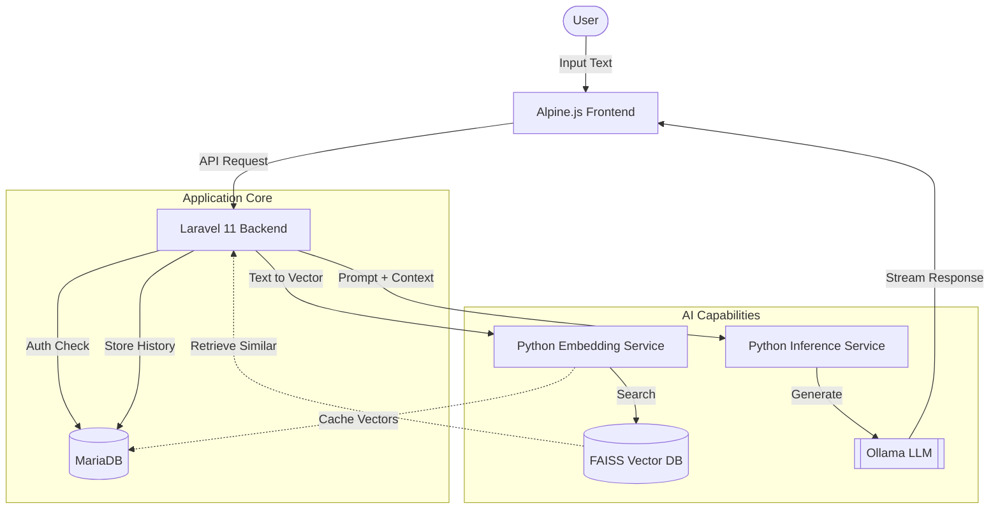

<p align="center">
  
</p>

# Masha Rephraser AI 🐈‍⬛

> _"The lazy cat with the best ideas. In training — furballs may occur."_

**Masha** is an intelligent rephrasing assistant designed to transform raw customer support notes into professional, empathetic, and structured responses. She learns from your corrections, maintains a searchable Knowledge Base, and adapts to different roles.

## ✨ Key Features

-   **Smart Rephrasing**: Turn bullet points into polished prose instantly.
-   **Context Awareness**: Retrieves similar past scenarios from the Knowledge Base (FAISS) to ensure consistency.
-   **Dynamic Roles**: Switch between "Tech Support" (analytical) and "Customer Support" (empathetic) personas, but open to adquire more identities.
-   **Knowledge Base Management**:
    -   **Auto-Save**: Approving a response saves it for future learning.
    -   **Edit & Refine**: Correct/update existing entries directly from the interface.
    -   **Review & Prune**: Identify and remove unused or outdated entries with a safe review workflow.
    -   **Optimization**: On-demand index rebuilding for lightning-fast search.
-   **Performance Analytics**: Track model latency, token usage, and leaderboard stats.

## 🚀 Getting Started

### Prerequisites

-   Docker & Docker Compose

### Installation

1. **Clone the repository**

    ```bash
    git clone <repo-url>
    cd rephraser_project
    ```

2. **Start the services**

    ```bash
    docker-compose up -d --build
    ```

3. **Access the Application**
    - **Frontend**: http://localhost:8000
    - **Masha is ready!** 🐾

## 🛠️ Architecture

The system follows a microservices-based architecture to separate concerns between application logic and heavy AI processing.



### Component Breakdown

-   **Alpine.js Frontend**: Handles real-time user interaction, streaming updates, and state management (e.g., dark mode, history).
-   **Laravel Backend**: The orchestrator. It manages authentication, sanitizes inputs, and routes requests to the appropriate AI service.
-   **Python Embedding Service**: Converts text into mathematical vectors. It uses a high-speed FAISS index to "remember" past good responses.
-   **Python Inference Service**: The brain. It constructs the final prompt (injecting context from FAISS) and talks to the refined AI model (e.g., Qwen/Gemma).
-   **MariaDB**: Stores robust relational data (Users, Roles, History Logs).
-   **FAISS**: A specialized database that allows Masha to find "conceptually similar" past examples, even if the wording is different.

## 🐱 Masha's Tips

-   **Review & Prune**: Use the "Rescan" button in the Prune modal to find entries that haven't been used in 30+ days.
-   **Golden Samples**: Manually add perfect examples to the KB to guide Masha's future style.
-   **Feedback**: If Masha gets it wrong, edit the text and hit "Approve" — she'll learn for next time.

## 📍 Roadmap

The following enhancements are planned for future updates:

-   **Bulk Edit**: Update multiple entries at once (e.g., bulk category changes).
-   **Advanced Filters**: Find candidates by keyword or template status.
-   **Export**: Export prune candidates to CSV for offline review.
-   **Scheduled Cleanup**: Automated background pruning for expired entries.

---

<p align="center">
  Made with a bossy cat and purrs.
</p>
