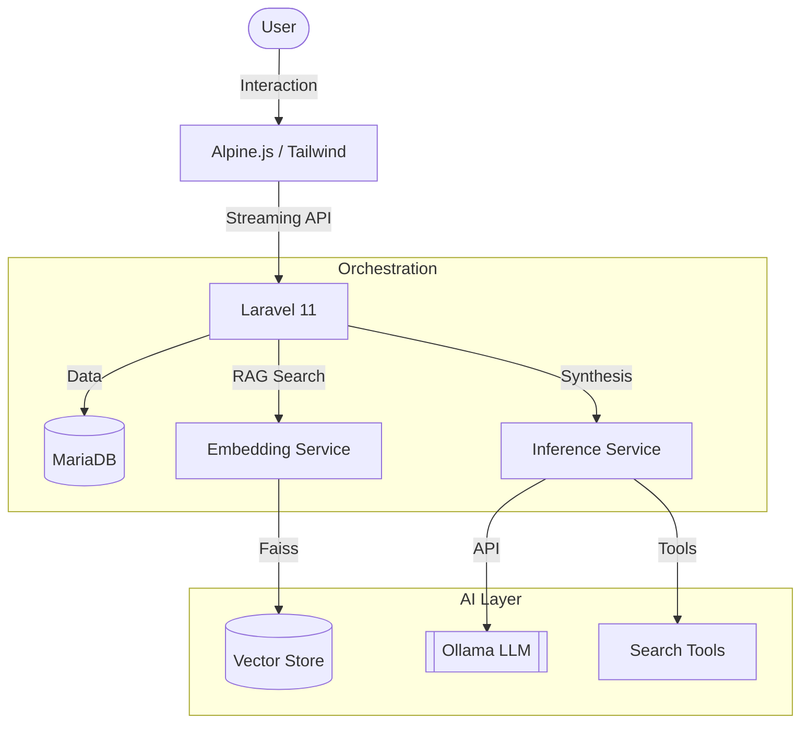

# Masha AI 🐈‍⬛

**Masha** is an AI-powered rephrasing system designed to transform technical support notes into professional, customer-ready responses. It leverages a local RAG (Retrieval-Augmented Generation) workflow to maintain consistency and empathy at scale.

---

## 🛠️ Architecture

Masha uses a microservice architecture to coordinate between the web interface, the knowledge base, and local AI inference.



---

## 🧩 Components

| Component        | Role         | How it Works                                                         |
| :--------------- | :----------- | :------------------------------------------------------------------- |
| **Laravel 11**   | Orchestrator | Manages routing, authentication, and service coordination.           |
| **Alpine.js**    | Pulse        | Handles real-time UI updates and token streaming.                    |
| **AI Embedding** | Search       | Uses Python + SentenceTransformers to find relevant KB entries.      |
| **AI Inference** | Brain        | Aggregates input + context to generate the final response.           |
| **Ollama**       | Engine       | Hosts local LLMs (Llama-3, etc.) for private, high-speed processing. |
| **FAISS**        | Memory       | Provides ultra-fast vector similarity search for the RAG pipeline.   |

---

## 🚀 Quick Start

1. **Requirements**: [Docker](https://www.docker.com/) & [Ollama](https://ollama.com/) (running locally).
2. **Setup**:
   ```bash
   git clone <repository-url>
   cd rephraser_project
   docker-compose up -d --build
   ```
3. **Launch**: Access at [http://localhost:8000](http://localhost:8000).

---

## ✨ Key Features

- **Real-Time Streaming**: Watch responses appear as they are thought out.
- **RAG Workflow**: Automatically pulls relevant past solutions to guide the AI.
- **Role Engine**: Technical vs. Empathetic personals for different audiences.
- **KB Management**: Tools to approve, edit, and prune institutional knowledge.
