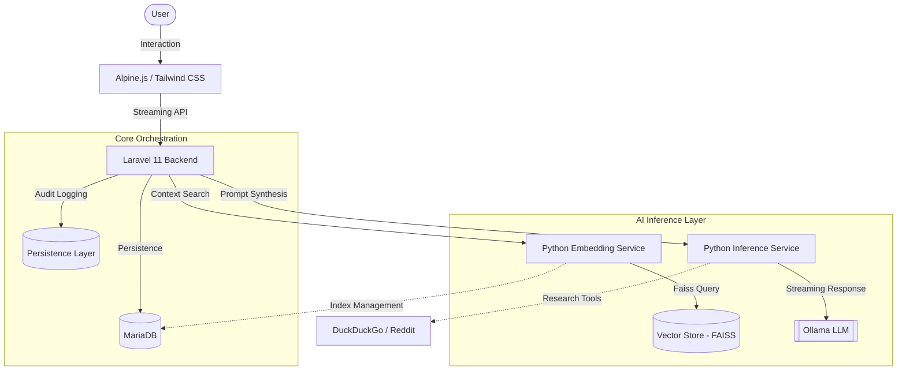

# Masha: The Support Analyst Rephraser AI 🐈‍⬛

> _"Precision in every purr. Efficiency in every response."_

**Masha** is a professional-grade rephrasing ecosystem designed for high-performance Technical Support Agents and Support Analysts. In an environment where one agent often handles the workload of many, Masha streamlines the transition from fragmented internal technical notes to client-ready professionalism.

---

## 🎯 Project Scope & Context

This ecosystem was developed to address the unique challenges of **high-volume technical support triage.**

As a support analyst, the pressure to maintain quality while managing complex technical debt and a constant ticket queue is immense. Masha acts as a cognitive force-multiplier, allowing you to:

- **Normalize Technical Data**: Instantly transform rough identifiers (MSISDN, IMEI, EID) or technician shorthand into structured, readable reports.
- **Maintain Empathy at Scale**: Automatically inject professional empathy into responses without manual phrasing overhead.
- **Retain Institutional Knowledge**: Build a "living" Knowledge Base of ideal responses that the AI references to ensure future consistency across the team.

---

## ✨ System Features

### 1. Adaptive Intelligence

- **Real-Time Token Streaming**: Responses appear word-by-word as they are synthesized, eliminating "wait-state" anxiety and providing immediate feedback.
- **Resource Profiling**: Automatically adjusts token limits and Knowledge Base retrieval depth based on the selected LLM to ensure stability on local hardware (e.g., Apple Silicon).
- **Technical Fast-Path**: Proactive identification of technical markers (IMEIs, MSISDNs, Error Codes) to bypass redundant AI processing and prioritize Knowledge Base accuracy.

### 2. Knowledge Management (RAG)

- **Vectorized Memory**: Leverages FAISS for semantic search, allowing Masha to retrieve "conceptually similar" past scenarios even if the wording differs.
- **Template Mode**: A specialized inference mode that anchors the AI to the rigid structure of your approved templates—ideal for standardized forms.
- **Lifecycle Maintenance**: A mature "Review & Pruning" workflow helps you identify and remove outdated or low-utility entries, keeping the system sharp and compliant.

### 3. Professional Personas (Role Engine)

- **Tech Support Profile**: Produces structured analysis including _Observations_, _Actions Taken_, and _Recommendations_.
- **Customer Support Profile**: Focuses on empathetic, direct customer communication with appropriate salutations and clear subject lines.
- **Extensible Roles**: Create custom roles with specialized system prompts for any specific department or workflow.

---

## 🛠️ Architecture

Masha utilizes a robust, microservice-heavy stack designed for high throughput, local privacy, and low latency.



### Component Details

| Component             | Responsibility                                                                                                  |
| :-------------------- | :-------------------------------------------------------------------------------------------------------------- |
| **Laravel 11**        | The central orchestrator. Handles session management, input sanitization, and coordination between AI services. |
| **Alpine.js**         | A lightweight reactive frontend framework managing real-time token streaming and UI state without overhead.     |
| **Python Embedder**   | Responsible for text-to-vector transformation and high-speed semantic retrieval using specialized indexes.      |
| **Python Inferencer** | The "brain" that combines user input, KB context, and web research into final prompts for the LLM.              |
| **Ollama**            | Local LLM host, providing high-speed, private inference for models like Llama-3, Phi-3, and Gemma.              |

---

## 🚀 Installation

1. **Prerequisites**: Ensure you have [Docker](https://www.docker.com/) and [Ollama](https://ollama.com/) installed locally.
2. **Setup**:
   ```bash
   git clone <repository-url>
   cd rephraser_project
   docker-compose up -d --build
   ```
3. **Launch**: Access the interface at [http://localhost:8000](http://localhost:8000).

---

## 📖 Maintenance & Best Practices

- **Consistency is King**: Always click "Approve" when Masha produces a perfect response. This "rewards" the system and populates the Knowledge Base for future users.
- **Pruning**: Use the "Prune Low Usage" tool monthly to remove logic that is no longer relevant to your current support procedures.
- **Scaling**: For complex investigations, enable "Online Research" to cross-reference your internal notes with current public documentation (Apple, Samsung, Carrier Forums).

---

<p align="center">
  <i>Developed for professionals who demand more from their tools.</i>
</p>
