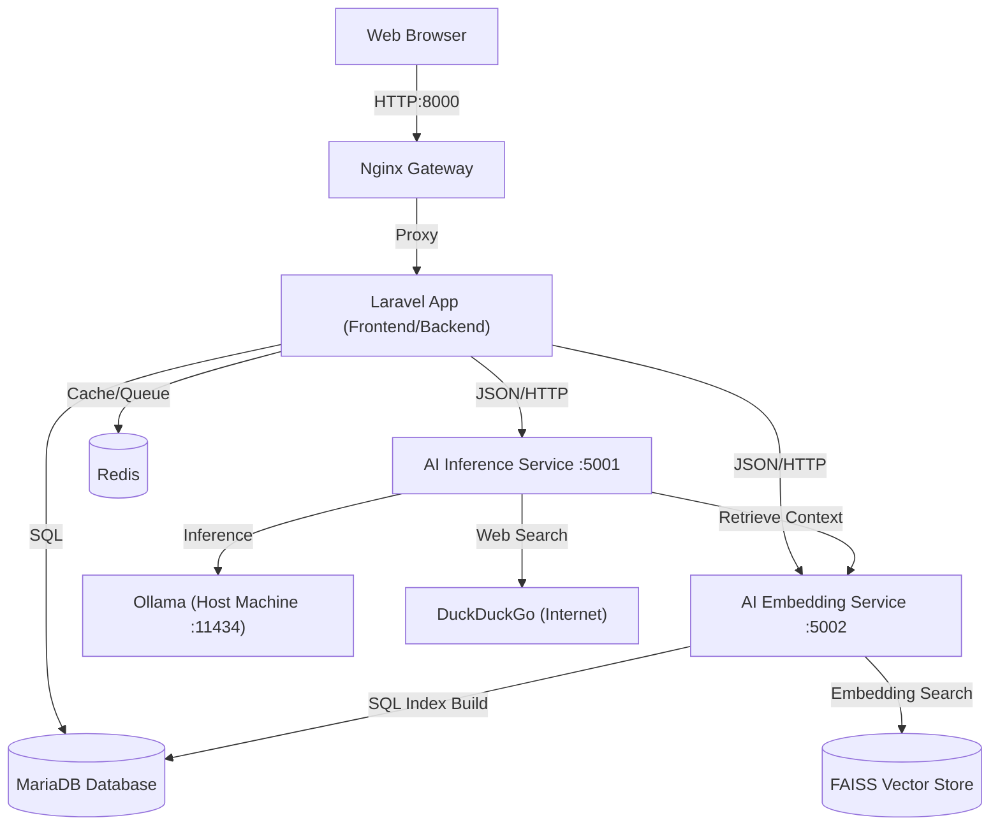
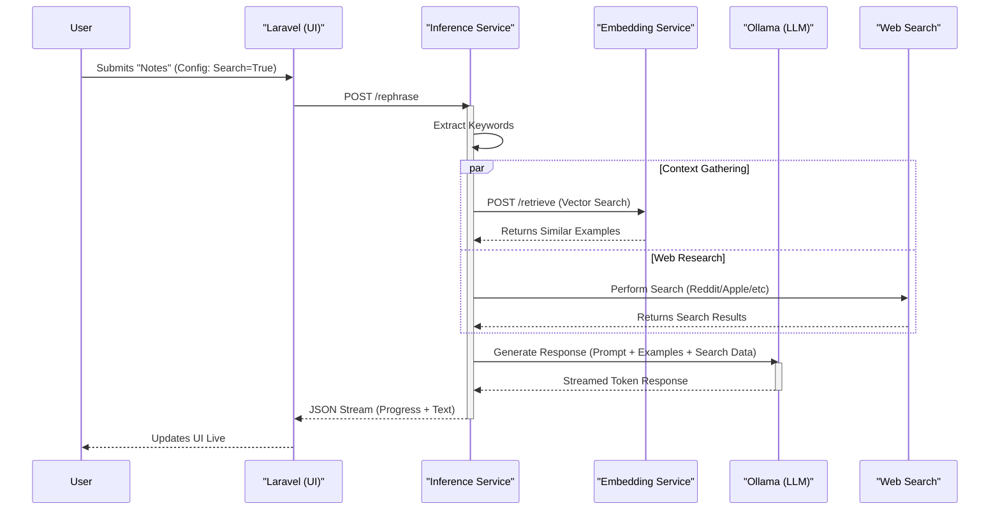

# Masha: The Rephraser AI

A professional, microservice-based application for knowledge-aware text rephrasing interactions. This system leverages local LLMs (via Ollama) and a RAG (Retrieval-Augmented Generation) pipeline to provide consistent, high-quality responses based on your own historical data. It now features **Fact Checking** capability via live web search and a **Template Mode** for rigid structure adherence.

---

## 🏗 Architecture

The project is built on a containerized microservice architecture:



### Components

- **Laravel (App)**: Handles the UI (Blade + Alpine.js), business logic, and database management. It acts as the primary orchestrator.
- **AI Inference Service (Port 5001)**: The core intelligence layer.
  - Handles `rephrase`, `suggest_keywords`, and `list_models` requests.
  - Manages **Fact Checking** (Web Search) and **Template Mode** logic.
  - Interacts with Ollama for text generation.
- **AI Embedding Service (Port 5002)**: The memory layer.
  - Manages the FAISS vector index.
  - Handles `retrieve` (Vector Search) and `trigger_rebuild` requests.
  - Periodically rebuilds the index from MariaDB.
- **MariaDB**: The "Source of Truth" for all knowledge base entries and audit logs.
- **Redis**: Caching and queue management.
- **Ollama**: External LLM provider running on the host machine (accessed via `host.docker.internal`).

### Workflow

The following sequence details the lifecycle of a rephrasing request:



---

## 🚀 Prerequisites

Before deploying, ensure you have the following installed on your host machine:

1.  **Docker Desktop** (or Docker Engine + Docker Compose).
2.  **Ollama**: This application relies on local LLMs.
    - [Download Ollama](https://ollama.com)
    - **Pull Models**:
      ```bash
      ollama pull llama3:8b-instruct-q3_K_M
      ollama pull gemma2:9b
      ```
    - **Start Ollama**: Ensure it is running (`ollama serve`).

---

## 🛠 Deployment From Scratch

### 1. Clone the Repository

```bash
git clone <repository-url>
cd rephraser_project
```

### 2. Configure Environment

```bash
cp laravel/.env.example laravel/.env
```

**Key Configuration (`laravel/.env`)**:

- `AI_INFERENCE_HOST`: `http://ai-inference:5001`
- `AI_EMBEDDING_HOST`: `http://ai-embedding:5002`

### 3. Start the Application

```bash
chmod +x start_docker.sh
./start_docker.sh
```

---

## ⚙️ Advanced Configuration & Modes

### Operational Modes (Mutually Exclusive)

1.  **Fact Check Mode** (`enable_web_search=True`)

    - **Goal:** Validate user notes against live web data.
    - **Behavior:** Performs Google/Reddit searches using extracted keywords. Injects search results into the prompt. Forces the model to `VALIDATE` and `CORRECT`.
    - **Constraint:** Disables Template Mode.

2.  **Template Mode** (`template_mode=True`)

    - **Goal:** Force strict adherence to a specific format.
    - **Behavior:** Retrieves the most similar example and instructs the model to act as a `TEMPLATE ADAPTER`.
    - **Constraint:** Disables Web Search.

3.  **Standard Mode** (Both False)
    - **Goal:** Professional rephrasing and grammar correction.
    - **Behavior:** Standard RAG pipeline using knowledge base examples for tone matching.

### Knowledge Base Persistence

- **Automatic Learning:** When you click **Approve**, the response is saved.
- **Metadata:** It now saves `is_template`, `keywords`, and `category` tags.
- **Import Rules:**
  - CSV/Bulk Import requires `original_text` and `rephrased_text`.
  - Optional columns: `keywords`, `category`, `is_template`.

### Model Insight & Statistics

- **Approval Tracking:** The system tracks which model generates approved responses.
- **Leaderboard:** View the "Models & Stats" tab in the Help Modal to see your most successful models.
- **Dynamic Help:** The guide updates automatically based on the models you have loaded in Ollama.

---

## 🔧 Troubleshooting

### "Ollama Connection Failed"

- **Fix**: Ensure Ollama is running (`ollama serve`). The architecture assumes `host.docker.internal` access.

### Rebuilding After Changes

If you modify Python code:

```bash
docker-compose up -d --build ai-inference ai-embedding
```
