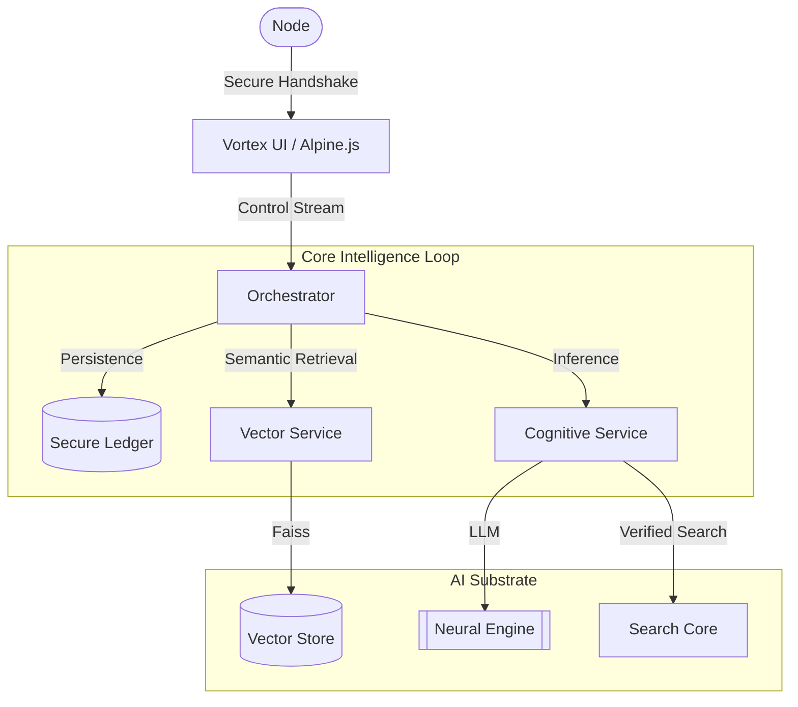

# Project Masha 🐈‍⬛

> **STRICTLY CONFIDENTIAL // EYES ONLY // SKUNKWORKS DIVISION**

Masha is a high-performance, AI-driven rephrasing engine engineered for the rapid transformation of technical field notes into boardroom-ready intelligence. By leveraging a localized RAG (Retrieval-Augmented Generation) architecture, Masha ensures data sovereignty while maintaining elite-level linguistic consistency.

---

## ⚡ Core Operational Capabilities

- **Neural Stream Synthesis**: Real-time token generation for zero-latency drafting.
- **Localized Vector Intelligence**: Deep semantic search against private technical corpora using FAISS.
- **Multi-Role Persona Engine**: Context-aware switching between high-level executive summaries and deep-dive technical diagnostics.
- **Autonomous Research Mode**: Real-time validation of technical claims via secure targeted web crawling.

---

## 🛠️ System Architecture

Masha operates on a decoupled microservice framework, optimized for horizontal scalability and low-latency inference.


```mermaid
graph TD
    User([Node]) -->|Secure Handshake| Frontend[Vortex UI / Alpine.js]
    Frontend -->|Control Stream| Laravel[Orchestrator]

    subgraph "Core Intelligence Loop"
        Laravel -->|Persistence| DB[(Secure Ledger)]
        Laravel -->|Semantic Retrieval| PyEmbed[Vector Service]
        Laravel -->|Inference| PyInfer[Cognitive Service]
    end

    subgraph "AI Substrate"
        PyEmbed -->|Faiss| KB[(Vector Store)]
        PyInfer -->|LLM| Ollama[[Neural Engine]]
        PyInfer -->|Verified Search| Web[Search Core]
    end
```

---

## 🚀 Rapid Deployment

1. **Prerequisites**: Docker Engine & Local Ollama Node.
2. **Initialization**:
   ```bash
   git clone <repository-url>
   ./start_docker.sh
   ```
3. **Access**: Secure portal established at `http://localhost:8000`.

---

## 📂 Technical Manifest

For detailed specifications, security protocols, and the development roadmap, refer to the [SKUNKWORKS.md](./SKUNKWORKS.md) manifest.
