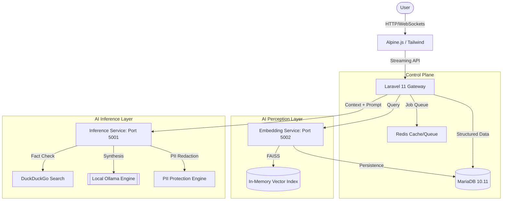

# Masha AI 🐈‍⬛

**Masha** is an AI-powered rephrasing system designed to transform technical support notes into professional, customer-ready responses. It leverages a local RAG (Retrieval-Augmented Generation) workflow to maintain consistency and empathy at scale.

---

## 🛠️ System Architecture

Masha operates as a distributed AI system, orchestrating high-performance RAG workflows across specialized microservices.


```mermaid
graph TD
    User([User]) -->|HTTP/WebSockets| Frontend[Alpine.js / Tailwind]
    Frontend -->|Streaming API| Laravel[Laravel 11 Gateway]

    subgraph "Control Plane"
        Laravel -->|Structured Data| DB[(MariaDB 10.11)]
        Laravel -->|Job Queue| Redis[Redis Cache/Queue]
    end

    subgraph "AI Perception Layer"
        Laravel -->|Query| PyEmbed[Embedding Service: Port 5002]
        PyEmbed -->|FAISS| Vector[(In-Memory Vector Index)]
        PyEmbed -->|Persistence| DB
    end

    subgraph "AI Inference Layer"
        Laravel -->|Context + Prompt| PyInfer[Inference Service: Port 5001]
        PyInfer -->|Fact Check| DDG[DuckDuckGo Search]
        PyInfer -->|Synthesis| Ollama[[Local Ollama Engine]]
        PyInfer -->|PII Redaction| Regex[PII Protection Engine]
    end
```

---

## 🧩 Component Specifications

| Component | Role | Technology Stack |
| :--- | :--- | :--- |
| **Laravel Gateway** | Orchestration & Auth | PHP 8.3, Laravel 11, Sanctum |
| **AI Embedding** | Vector Search (RAG) | Python, FAISS, SentenceTransformers |
| **AI Inference** | Prompt Engineering | Python, Flask, GenAI SDK |
| **Ollama** | Local LLM Engine | Llama-3, Mistral, etc. |
| **Storage** | Persistence & Cache | MariaDB 10.11, Redis 7 |
| **Frontend** | Reactive Interface | Alpine.js, Tailwind CSS |

---

## 🚀 Quick Start

### 1. Prerequisites
- **Docker & Docker Compose**
- **Ollama** (Running on host machine)
- **API Keys**: Google Gemini API Key (required for high-tier models)

### 2. Setup & Execution
```bash
# Clone the repository
git clone <repository-url>
cd rephraser_project

# Configure Environment
cp .env.example .env # Ensure DB_PASSWORD and GEMINI_API_KEY are set

# Launch Services
docker-compose up -d --build
```

### 3. Access
The application will be available at [http://localhost:8000](http://localhost:8000).
The AI Inference service runs on `:5001` and the Embedding service on `:5002`.

---

## ✨ Key Features

- **Real-Time Streaming**: Watch responses appear as they are thought out.
- **RAG Workflow**: Automatically pulls relevant past solutions to guide the AI.
- **Role Engine**: Technical vs. Empathetic personals for different audiences.
- **KB Management**: Tools to approve, edit, and prune institutional knowledge.
