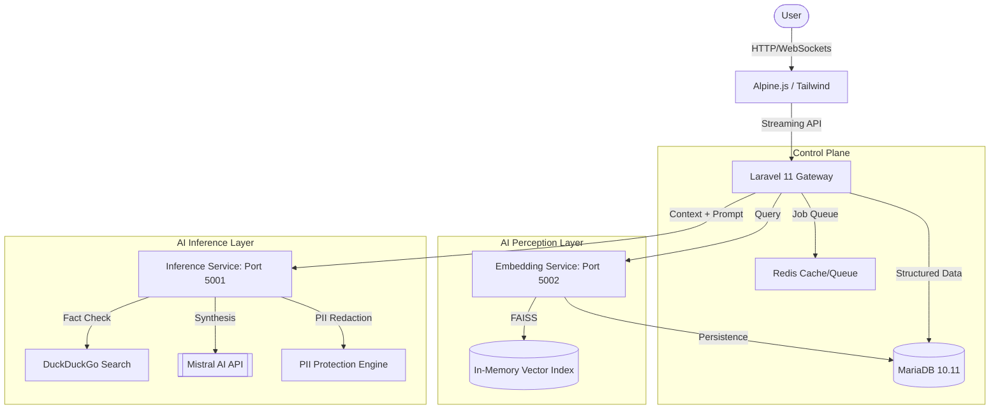

# Masha AI 🐈‍⬛

**Masha** is an AI-powered rephrasing system designed to transform technical support notes into professional, customer-ready responses. It leverages a local RAG (Retrieval-Augmented Generation) workflow to maintain consistency and empathy at scale.

---

## 🛠️ System Architecture

Masha operates as a distributed AI system, orchestrating high-performance RAG workflows across specialized microservices.


```mermaid
graph TD
    User([User]) -->|HTTP/WebSockets| Frontend[Alpine.js / Tailwind]
    Frontend -->|Streaming API| Laravel[Laravel 11 Gateway]

    subgraph "Control Plane"
        Laravel -->|Structured Data| DB[(MariaDB 10.11)]
        Laravel -->|Job Queue| Redis[Redis Cache/Queue]
    end

    subgraph "AI Perception Layer"
        Laravel -->|Query| PyEmbed[Embedding Service: Port 5002]
        PyEmbed -->|FAISS| Vector[(In-Memory Vector Index)]
        PyEmbed -->|Persistence| DB
    end

    subgraph "AI Inference Layer"
        Laravel -->|Context + Prompt| PyInfer[Inference Service: Port 5001]
        PyInfer -->|Fact Check| DDG[DuckDuckGo Search]
        PyInfer -->|Synthesis| MistralAPI[[Mistral AI API]]
        PyInfer -->|PII Redaction| Regex[PII Protection Engine]
    end
```

---

## 🧩 Component Specifications

| Component | Role | Technology Stack |
| :--- | :--- | :--- |
| **Laravel Gateway** | Orchestration & Auth | PHP 8.3, Laravel 11, Sanctum |
| **AI Embedding** | Vector Search (RAG) | Python, FAISS, SentenceTransformers |
| **AI Inference** | Prompt Engineering | Python, Flask, Requests |
| **Mistral Engine** | Cloud LLM Provider | Mistral API (`open-mistral-nemo`, `mistral-small-latest`, `mistral-tiny`) |
| **Storage** | Persistence & Cache | MariaDB 10.11, Redis 7 |
| **Frontend** | Reactive Interface | Alpine.js, Tailwind CSS, Vite |

---

## 🚀 Quick Start

### 1. Prerequisites
- **Docker & Docker Compose**
- **API Keys**: Mistral API Key (`MISTRAL_API_KEY`)

### 2. Setup & Execution
```bash
# Clone the repository
git clone <repository-url>
cd rephraser_project

# Configure Environment
cp laravel/.env.example laravel/.env # Set MISTRAL_API_KEY in laravel/.env

# Launch Services
docker compose up -d --build
```

### 3. Access
The application will be available at [http://localhost:8123](http://localhost:8123).
The AI Inference service runs on `:5001` and the Embedding service on `:5002`.

---

## ✨ Key Features

- **Real-Time Streaming**: Watch responses appear as they are generated.
- **RAG Workflow**: Automatically pulls relevant past solutions using FAISS vector search.
- **Role Engine**: Technical vs. Empathetic personas for different audiences.
- **Mistral Free Tier Integration**: Optimized for `open-mistral-nemo`, `mistral-small-latest`, and `mistral-tiny`.
- **KB Management**: Tools to approve, edit, and prune institutional knowledge.
