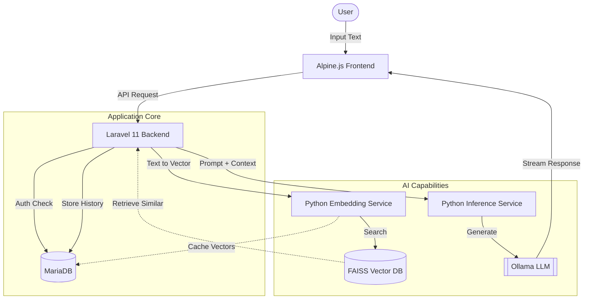

# Masha Rephraser AI

Masha is an intelligent rephrasing assistant designed to transform raw customer support notes into professional, empathetic, and structured responses. It learns from user corrections, maintains a searchable knowledge base, and adapts to different communication styles through configurable roles.

## Features

-   **Intelligent Rephrasing**: Converts bullet points, fragmented notes, or rough drafts into polished, professional text suitable for customer communication.
-   **Context-Aware Responses**: Leverages a FAISS-based vector search to retrieve similar past interactions from a knowledge base, ensuring consistency and leveraging historical data.
-   **Dynamic Roles**: Allows users to switch between different personas (e.g., "Tech Support," "Customer Support") to tailor the tone and structure of the generated response.
-   **Knowledge Base Management**:
    -   **Auto-Save**: Approved responses are automatically saved to the knowledge base for future reference.
    -   **Edit & Refine**: Existing entries in the knowledge base can be edited and updated directly through the user interface.
    -   **Review & Prune**: A dedicated interface allows for reviewing and removing outdated or low-usage entries from the knowledge base.
    -   **Index Optimization**: Provides an on-demand mechanism to rebuild the FAISS index for optimal search performance.
-   **Performance Analytics**: Tracks model latency, token usage, and provides a leaderboard to monitor the performance of different models.

## Architecture

The system is designed with a microservices-based architecture to decouple the application logic from the AI processing workloads.



### Component Breakdown

-   **Alpine.js Frontend**: A lightweight, reactive frontend that handles user interactions, streams responses from the backend, and manages the application state.
-   **Laravel Backend**: The central orchestrator of the application. It manages user authentication, handles API requests, and coordinates with the AI services.
-   **Python Embedding Service**: Responsible for converting text into vector embeddings and searching the FAISS index for similar entries.
-   **Python Inference Service**: Constructs the final prompt by injecting context from the FAISS search and interfaces with the language model (e.g., Qwen, Gemma) via Ollama.
-   **MariaDB**: The primary relational database for storing user data, roles, and historical logs.
-   **FAISS**: A vector database used for efficient similarity search, enabling the system to find conceptually similar past responses.

## Getting Started

### Prerequisites

-   Docker
-   Docker Compose

### Installation

1.  **Clone the repository:**
    ```bash
    git clone <repository-url>
    cd rephraser_project
    ```
2.  **Start the services:**
    ```bash
    docker-compose up -d --build
    ```
3.  **Access the application:**
    -   **Frontend**: `http://localhost:8000`

## Considerations & Limitations

-   **Cold Starts**: The AI services, particularly the inference service, may experience a "cold start" delay on the first request after a period of inactivity.
-   **Resource Intensive**: Running multiple AI models and services requires a significant amount of RAM and CPU resources.
-   **Vector Search Tuning**: The effectiveness of the context-aware responses is highly dependent on the quality of the data in the knowledge base and the tuning of the FAISS search parameters.

## Roadmap

-   **Bulk Editing**: Implement functionality to edit multiple knowledge base entries at once.
-   **Advanced Filtering**: Add options to filter knowledge base entries by keyword or template status.
-   **CSV Export**: Allow users to export prune candidates to a CSV file for offline review.
-   **Scheduled Cleanup**: Implement an automated background process for pruning expired or low-usage entries from the knowledge base.
